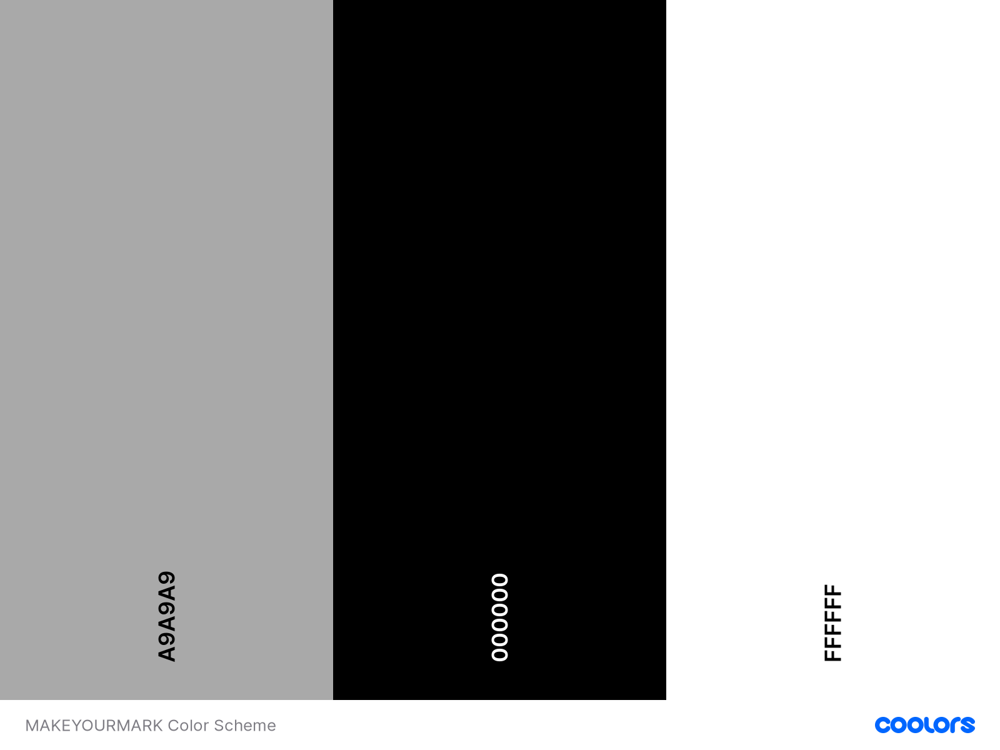

# MAKEYOURMARK

 

 

## Contents

* UX
    * Project Goals
    * User Goals
    * User Stories
    * Site Owner Goals
    * User Requirements and Expectations
    * Design Choices
        * Fonts
        * Icons
        * Colours
        * Images
* Features
* Technologies
    * Features that have been developed
    * Features that will be implemented in the future
* Testing
* Bugs
* Deployment
* Credit

## User Experience (UX) ##

---

## The project goal ##

The **goal** for this project is to offer a top quality gym service with exceptional classes for people of all ages and fitness levels.

## User Goals ##

### as a visitor to MAKE YOUR MARK I want.. ###

* To find **contact details** for this gym service.
* To find **information** for this gym service in an **about us** section.
* To view the **classes** and its prices that are on offer in this gym.
* To see the **reviews** of past and current users of the gym.
* To view the different **memberships** and its prices on offer.
* To view **images** of the classes on offer and the gym itself(image carousel).
* To see where the gym is **located**

## User Stories ##

* **As a user** I want to **a simplified, easy to read, navigate and viewable website** so I will be **educated** and **informed** on the service that is on offer. 
* **As a user** I want to find out **why** I should **preference** membership of this gym over competitors.
* **As a user** I want to **contact** the site owner over any current or potential **queries** I have or may have in the future.
* **As a user** I want to see the **results of people who have joined this gym** or **recommendations** so that it would **encourage** me to select this gym.

## Site Owner Goals ##

* **As a site owner** I want to offer a gateway for potential clients to book classes and memberships.
* **As a site owner** I want to **inform** potential clients of the contact details and location of the service.
* **As a site owner** I want to **display the prices** of both the classes and the memberships.
* **As a site owner** I want to utilise the website to **attract** potential clients and advertise the service and **boost brand loyalty**.

## User requirements and Expectations ##

**Requirements**
* To **Navigate** across the website using the navbar provided.
* To be provided with **information** of what the service provides such as classes and memberships.
* The text, imagery to be shown in a **readabale** and **attractive manor**.
* The **contact form** to be operating with no faults.

**Expectations**
* **Navigation** across the website is quick and simple using the navbar.
* **Information** of the services is provided and easy to find.
* The text, imagery shown is **readable** and displayed in an **attractive manor**
* Contact form operating with **no faults**.

## Design choices ##

When **designing** this website I looked for inspiration off several gym websites at first. I then came across [TNTGYM](https://tntgymsligo.ie/tnt-gym-sligo-opening-times/). On this page you can clearly 
see the membership rates along with what is attached to each rate.
I liked the way each membership rate broke down what it comes with. I used [bootstrapcards](https://getbootstrap.com/docs/5.0/components/card/) for both my classes page and membership page. I believed
a website with a consistent format made for easy viewing and readability.

### fonts ###

I decided to use the [epilogue](https://fonts.google.com/specimen/Epilogue?query=epilogue) font due to personal liking and found it as nice attractive text for the user to read with. I incorporated this font from [googlefonts](https://fonts.google.com/).
Sans-serif was used as the back up font in case epilogue did nit work.

### Icons ###

Icons for this website were delivered by [fontawesome](https://fontawesome.com/icons?d=gallery). Icons were used as a styling purpose for elements such as the brand name in the navbar and for
the footer beside the email and phone contact details.

### Colors ###

Before deciding on what color scheme to adopt I did some research on the benefits of using certain color schemes. According to [shutterstock](https://www.shutterstock.com/blog/black-background-design-for-websites) "While pairing #000000 with crisp white can create a high-impact scheme". I used this for my containers and container text.
I used coolors to get portray my color scheme.

* Body element was given a light grey hex value: #a9a9a9;
* Containers were given a black hex value: #000000;
* Text, navbar and navlinks was given a white hex value: #000000;

### Images ###

Images used for the website are linked below. I wanted to use engaging images that were engaging and relevant such as to a particular class.

**Images**

* [Carousel Images](https://github.com/markgordon22/MAKEYOURMARK/tree/main/assets/img/img-carousel)

* [Classes Images](https://github.com/markgordon22/MAKEYOURMARK/tree/main/assets/img/img-classes)

* [Membership Image](https://github.com/markgordon22/MAKEYOURMARK/tree/main/assets/img/img-memberships)

* [Reviews Images](https://github.com/markgordon22/MAKEYOURMARK/tree/main/assets/img/img-reviews)

## Wireframing ##

I began wireframing with a pen and paper to get a rough feel of what I wanted my site to look and feel. I downloaded [balsamiq](https://balsamiq.com/) to complete my wireframes for **MAKEYOURMARK**
View my wireframes [here](https://github.com/markgordon22/MAKEYOURMARK/tree/main/wireframes).

The 4 pages below contain the wireframe devices of mobile, tablet and desktop.

* [homepage](https://github.com/markgordon22/MAKEYOURMARK/blob/main/wireframes/homepage.pdf)

* [Ourclassespage](https://github.com/markgordon22/MAKEYOURMARK/blob/main/wireframes/ourclassespage.pdf)

* [Membershipspage](https://github.com/markgordon22/MAKEYOURMARK/blob/main/wireframes/membershipspage.pdf)

* [contactpage](https://github.com/markgordon22/MAKEYOURMARK/blob/main/wireframes/contactpage.pdf)

# Features #

Features that have been implemented to MAKEYOURMARK are the following.

* simple use of **navigation** on wireframe devices.
* Sharp and **attractive** design
* **Contact form** with submit button
* **Social media links** such as Facebook and Instagram and email and phone contact details with **icons** from font awesome
* **Image carousel** of photos from the gym.
* **Cards** from bootstrap used for advertising the classes and its memberships.

Features to implement.

* None

# Technologies #

**Technologies** used include the following.

* [HTML](https://en.wikipedia.org/wiki/HTML). Hyper Text Markup Language, used for website structure.
* [CSS](https://en.wikipedia.org/wiki/CSS). Cascading style Sheets, used for website styling.
* [Bootstrap](https://getbootstrap.com/docs/5.0/getting-started/download/). To enhance responsiveness of website.
* [Google Fonts](https://fonts.google.com/). To incorporate google fonts for website.
* [Font awesome](https://fontawesome.com/icons?d=gallery). To incorporate icons for website.
* [Git](https://en.wikipedia.org/wiki/Git). Used version control to add,commit and push files to github.
* [Git Hub](https://en.wikipedia.org/wiki/GitHub). Used for hosting files used for the website.
* [Git pod](https://www.gitpod.io/docs/). IDE for working on my code.
* [Autoprefixer](https://autoprefixer.github.io/).  parses your CSS and adds vendor prefixes.
* [lighthouse](https://developers.google.com/web/tools/lighthouse). Website performance testing utility in Chrome DevTools (the very right of the toggle bar)
* [Chrome dev tools](https://developers.google.com/web/tools/chrome-devtools). A helpful tool used throughout the website development process to debug code and gave me access to the lighthouse testing utility.
* [Tiny png](https://tinypng.com/). Was able to shrink images sizes to ensure faster loading times.
* [W3 HTML validator](https://validator.w3.org/). Online HTML testing validator.
* [W3 CSS validator](https://jigsaw.w3.org/css-validator/). Online CSS tetsing validator.
* [Jquery](https://en.wikipedia.org/wiki/JQuery). Dependencie that bootstrap requires for some of its components to work. 
* [Popper](https://cdnjs.com/libraries/popper.js/2.5.3). Dependencie that bootstrap requires for some of its components to work. 

## Testing ##

For testing I used [W3 HTML validator](https://validator.w3.org/) to check on errors in my html code for all pages and to correct them for submission.
I received errors from each of the four pages of the website. 

All 4 pages received these erros and fixes outlined below. 

   **errors**

   * gaps in the a href attribute of the phone number
   * p tags seen as children of the ul parent
   * stray div tags apparent
   * stray closing script ags apparent
   * no closing a tags for social media links.

   **fixes**

   * removed gaps from a href attribute of the phone number.
   * removed p tags as children of the ul parent.
   * removed stray div tags.
   * removed stray closing script tags
   * Inserted closing a tags for social media links.

I also used [W3 CSS validator](http://jigsaw.w3.org/css-validator/) to check on errors to eventually be corrected for final submission.
CSS is clean with no erros or warnings.

**errors**

* Card-img-top has to many values or values are not recognized : none. indicating the border radius class value.

**fixes**

* removed the border radius class.

## Bugs ##

Here are some of the **bugs** i encountered along the way of MAKE YOUR MARK

* Bug: Images in bootstrap cards and cards itself were extremely narrow on mobile and tablet devices
  Solution: Decreased the padding of the containers so that the cards could take up more room of the container so they could be easier
  to view and read.

* Bug: Navbar brand was not balanced on mobile and tablet devices.
  Solution: withrew the letter spacing.

* Bug: Image carousel images was switching to different sizes and thus making the container turn to different heights.
  Solution: gave each image carousel image a fixed height of 400px.

* Bug: social media links in footer were jumping to different lines on mobile.
  Solution: Gave a smaller padding so they wouldnt jump line.

* Bug: Bootstrap cards stuck to eachother as they were given a height of h-100
  Solution: removed h-100 class and gave a margin so that there will be some space between the cards.

* Bug: Contact form would not function correctly and wouldnt spot false email addresses without an @ or a false phone number.
  Solution: Inserted a class of class="form-control" in all inputs of the form and also gave a pattern class of pattern="[0-9]{3}[0-9]{3}[0-9]{4}" 
  to inform users the pattern of how to format the insertion of their phone number.

## Deployment ##

**MAKE YOUR MARK** was built on gitpod with the use of git and github in order to host the repository.
When deploying **MAKE YOUR MARK** to github pages the following steps were taken.

* Type github into browser
* Signed in with respective username and password
* Select repository you wish to deploy github pages
* Select MAKE YOUR MARK repository
* Select settings(the very right of the menu)
* Scroll down settings until you get to github pages
* Select main branch from the drop menu provided
* Click to confirm using the save button on the right
* **MAKE YOUR MARK** is now live on github pages

### Cloning ###

If you rather working on the repository on a local level, you are able to clone the repository to your own desktop by following the steps outlined below.

* Go to [MAKE YOUR MARK github page](https://github.com/markgordon22/MAKEYOURMARK)
* Go to the code button just to the left of the green gitpod button
* To clone the repository using https, SSH or Github cli click the paste icon on the right
* Open terminal
* Change the current working directory to the location where you want the cloned directory.
* Type git clone, and then paste the URL you copied earlier.
* Press Enter to create your local clone.

## Credits ##

Images for MAKE YOUR MARK

Image carousel

* [Carousel1](https://www.itl.cat/pngfile/big/317-3173165_man-and-woman-holding-battle-ropes-energy-exercise.jpg)
* [Carousel2](https://c4.wallpaperflare.com/wallpaper/833/553/163/brunette-workout-fitness-gym-wallpaper-preview.jpg)
* [Carousel3](https://wallpaperaccess.com/full/834254.jpg)
* [Carousel4](https://wallsdesk.com/wp-content/uploads/2016/10/Gym-full-HD-1.jpg)

 

